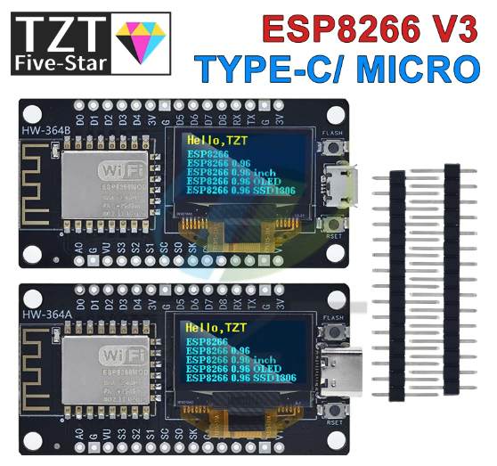

# arduino-esp8266-oled
Some samples of codes to run in the Arduino ESP8266 + OLED board available in some chinese sellers.

This is what the seller pic looks like:


## Preparing the Arduino IDE with the correct Libs

In the **Preferences** menu, add the following external URL:
http://arduino.esp8266.com/stable/package_esp8266com_index.json

Then in the **Tools -> Board -> Board Manager** , install the board `esp8266 by ESP8266 Community`.

Now, you should be able to select the board `NodeMCU 1.0 (ESP-12E module)` in the board list.

Finally to add the drivers to the OLED, find **Sketch -> Add Lib -> Lib Manager** and look for the keyword SSD1306, to install the `ESP8266 and ESP32 Oled Driver for SSD1306 Display`

## Starting the Display

This can be achieved by the code:
```
#include <Wire.h>
#include "SSD1306Wire.h"

// Starts OLED Display
SSD1306Wire  display(0x3c, D5, D6);
```

Notice that for this specific board, the SDA is in D5 and SCL is in D6.

### References
[Arduino e Cia - NodeMCU ESP8266 with OLED i2c](https://www.arduinoecia.com.br/nodemcu-esp8266-com-display-oled-i2c/)
